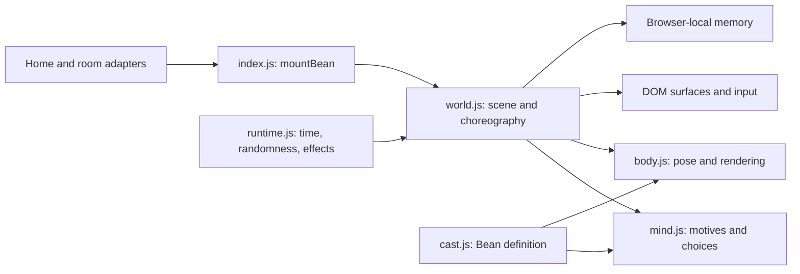

# Bean engine 1.0 candidate

This describes the code that exists. It is an incremental boundary around the
existing rig and choreography, not a claim that every planned subsystem is done.



## Page integration

Use `mountBean(options)` from `src/scripts/cats/index.js`. It mounts at most one
world on the current page and returns a frozen facade. Desktop home and room
adapters already use it. Phone/touch-first layouts return an inert facade and
keep the static fallback.

| Method | Contract |
| --- | --- |
| `observe({ title, users })` | Supplies video-title and viewer-count context. Other current room fields are ignored. Playback state still comes from `body.dataset.playback`. |
| `linkError(message)` | Reacts to an unsuccessful link action. |
| `inviteCopied()` | Reacts to a copied invite. |
| `greet()` | Invites Bean to notice, approach, sniff, offer a paw and settle. Returns false during an existing approach, carrying or a short repeat guard. Wakes Calm mode. |
| `treat(x?, y?)` | Drops a treat at optional viewport coordinates. |
| `laser(on)`, `calm(on)`, `aquarium(on)` | Set existing viewer controls. |
| `snapshot()` | Returns detached diagnostic data: seed, runtime status, scene context, activity/phase, location, drives, mood, trust, position and director inspection. Disabled layouts return `{ disabled: true, cats: [] }`. |
| `destroy()` | Saves memory, cancels owned work, restores temporary page changes and releases the mount. Safe to repeat. Old facade commands become inert. |

The facade exposes `version: '1.0.0-rc.1'`. This is a local release candidate;
full-page visual/performance QA remains outstanding. Direct actor/world mutation is an internal
testing detail, not a page integration contract. Preserve current methods or
migrate their callers explicitly when evolving this boundary.

## Time and lifecycle

`runtime.js` owns one requestAnimationFrame loop, its random source, delayed
effects, registered listeners and cleanup callbacks. Its clock advances in
seconds with a maximum 50 ms step. The first frame and first frame after resume
use zero elapsed time. `delay(fn, milliseconds)` uses this simulation clock and
returns a cancellation function. It does not create a native timeout.

Hidden pages pause the runtime and running decoration animations. Resuming
does not fast-forward animation. Long absences still use the older bounded
drive-update/flavor-diary policy; this is not an offscreen simulation. Persisted
pagehide/pageshow events suspend/resume; a non-persisted pagehide destroys the
mount. Teardown also cancels page animations, restores inert containers and
decorations, removes cat cursor classes, and clears the debug global.

Use runtime-owned scheduling for new effects. Cleanup registration is separate
from animation choreography: closing the world must clean it even if the action
has not finished. `cancelPlan` closes generators at common interruption paths
and on disposal so `finally` blocks can run. Cleanup in a generator must be
synchronous and must not yield. A complete scoped action runner remains future
work; do not assume delayed effects are automatically cancelled per action.

## Randomness and inspection

One session RNG is passed through world choices, Mind and CatBody, including
blinking and initial pose variation. `mountBean({ seed: 42 })` provides a seed.
For development, `?catdebug&catseed=42` exposes `window.youpleCats`, with:

```js
youpleCats.snapshot();
youpleCats.play('Bean', 'loaf');
youpleCats.play('Bean', 'groom');
youpleCats.peekIn('Bean');
youpleCats.measure();
```

The query-string seed is honored only with `catdebug`. Seeds make controlled
tests repeatable; they do not yet replay a browser session. Layout, memory,
calendar time, frame cadence and input still affect outcomes. Pointer velocity
uses input timestamps to preserve precision between animation frames. Separate
RNG streams and recorded scenario inputs can be introduced when needed.

## Cozy acting and pacing

Bean's `cast.pacing` defines action cooldowns, attention costs and quiet recovery.
`Mind.tick()` advances them on simulation time. `choose(context)` scores motives
and applies these gates; `canStart()` applies the same gates to automatic world
events such as noticing a butterfly. `inspect()` returns detached cooldowns,
attention and the last scored decision with suppression reasons. A direct user
command can interrupt without being a newly scored autonomous decision.

`cursorDwell` measures seconds held within a small radius outside controls.
Crossing off a control resets this clock. `invitedPlay` is a short window after
explicit petting, toys or greeting; normal pointer travel is not an invitation.
Quiet playback satisfies companionship and slows the buildup of play energy.
Titles remain hints, not audio analysis. Playback starting redirects unsolicited
antics toward watching; explicit play and existing rest retain their priority.

The `approach` generator commits to one safe floor destination and exposes
readable phases. Its `finally` clears temporary gestures. Closing an airborne
travel generator starts a recovery fall with an independent landing continuation,
preserving the visible height. Calm cancels the greeting and maintains sleep;
Wake Bean opens the sleeping expression. Reduced-motion laser play is stationary.

`CatBody` layers chest breathing, delayed head movement, acceleration/turning
weight shifts and distance-based paw cadence over existing poses. Straight
walking has planted stance phases; this is not full foot IK through sharp turns.
`slowBlink(duration)` layers over eye goals. `offerPaw` is a separate gentle held
gesture; it does not reuse the vibrating swat. Resting poses blend more slowly,
and relaxed eyes no longer get a second heavy, straight eyelid.

## Where to add an improvement

- **Look or proportions:** extend the Bean definition and `CatBody`. Preserve
  recognizable front, side and back views and existing named pose channels.
- **Acting:** compose existing movement/pose generators first. A new reusable
  action should have a trigger, anticipation, main movement, recovery and
  interruption cleanup. Do not add another independent animation loop.
- **Motivation:** extend the DOM-free Mind with injected context and test the
  choice, cooldown or drive change. Keep mood separate from a rendering effect.
- **Page interaction:** currently belongs to world geometry/input adapters.
  Read measured surfaces; protect real controls and restore temporary changes.
- **Memory:** currently uses `youple-cats-v1`. Preserve existing Bean trust and
  counts. Add a validated, versioned schema before expanding stored state.

The largest remaining seams are action selection/running, DOM geometry and
memory, currently inside world.js. Extract each with an actual feature that
needs it. The renderer also currently computes hit/head/paw geometry during
drawing; separate pose evaluation before building headless replay or skipping
renders. Do not split files only to make a diagram look complete.

## Validation

`test/cat-runtime.test.js` controls a fake clock and frame queue.
`test/cats-world.test.js` exercises startup, inputs, real simulation steps with
a no-op canvas, hidden/resume, generator cleanup, teardown and remount.
`test/cats.test.js` covers motives, memory and rig movement/seeded blinking.
`test/cat-motion.test.js` checks breath, stance, weight transfer, slow blinks and
the held paw gesture. `test/cat-pacing.test.js` checks quiet video sessions,
cooldown intervals, invitation precedence and decision traces. World tests also
run the entire invitation and verify recovery, long Calm rest and cursor intent.

`scripts/render-bean.mjs` renders the actual rig independently, without loading a
page. Supply an existing `@napi-rs/canvas` installation via `BEAN_RENDER_MODULES`
(its parent node_modules directory), then run
`node scripts/render-bean.mjs ../output/bean-motion`. It writes 540 PNG frames,
a contact sheet and capture metadata. This is a scripted rig study, not an
end-to-end capture of the production greeting or an extra deployed dependency.

Run focused tests, then `npm test` and `npm run check`. Stop Wrangler preview
before builds and restart after. The no-op canvas tests validate runtime logic,
not visual quality or browser performance; rendering review is a separate gate.
