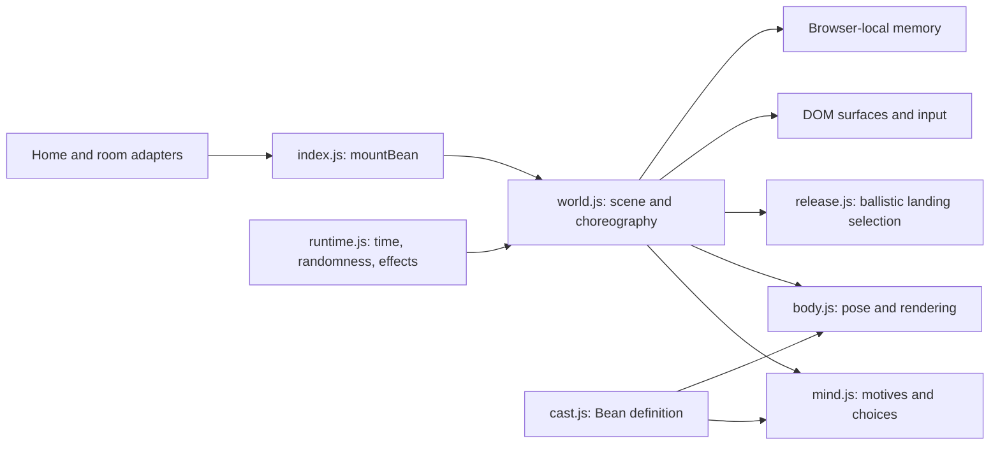

# Bean engine 1.0 candidate

This describes the code that exists. It is an incremental boundary around the
existing rig and choreography, not a claim that every planned subsystem is done.



## Page integration

Use `mountBean(options)` from `src/scripts/cats/index.js`. It mounts at most one
world on the current page and returns a frozen facade. Desktop home and room
adapters already use it. Phone/touch-first layouts return an inert facade and
keep the static fallback.

| Method | Contract |
| --- | --- |
| `observe({ title, users })` | Supplies video-title and viewer-count context. Other current room fields are ignored. Playback state still comes from `body.dataset.playback`. |
| `linkError(message)` | Reacts to an unsuccessful link action. |
| `inviteCopied()` | Reacts to a copied invite. |
| `greet()` | Invites Bean to notice, approach, sniff, offer a paw and settle. Returns false during an existing approach, carrying or a short repeat guard. Wakes Calm mode. |
| `treat(x?, y?)` | Drops a treat at optional viewport coordinates. |
| `laser(on)`, `calm(on)`, `aquarium(on)` | Set existing viewer controls. |
| `snapshot()` | Returns detached diagnostic data: seed, runtime status, scene context, activity/phase, location, drives, mood, trust, position and director inspection. Disabled layouts return `{ disabled: true, cats: [] }`. |
| `destroy()` | Saves memory, cancels owned work, restores temporary page changes and releases the mount. Safe to repeat. Old facade commands become inert. |

The facade exposes `version: '1.0.0-rc.2'`. This is a release candidate;
full-page visual/performance QA remains outstanding. Direct actor/world mutation is an internal
testing detail, not a page integration contract. Preserve current methods or
migrate their callers explicitly when evolving this boundary.

`CatUniverse.astro` provides a compact menu opened by right-clicking Bean or the
small paw fallback button. It supports arrow/Home/End navigation, Escape/Tab,
outside dismissal and viewport clamping. Aquarium is a separate dock button.
The former profile, diary and home playbar are no longer rendered; existing
memory remains compatible.

## Time and lifecycle

`runtime.js` owns one requestAnimationFrame loop, its random source, delayed
effects, registered listeners and cleanup callbacks. Its clock advances in
seconds with a maximum 50 ms step. The first frame and first frame after resume
use zero elapsed time. `delay(fn, milliseconds)` uses this simulation clock and
returns a cancellation function. It does not create a native timeout.

Hidden pages pause the runtime and running decoration animations. Resuming
does not fast-forward animation. Long absences still use the older bounded
drive-update/flavor-diary policy; this is not an offscreen simulation. During
playback, long resumes preserve position/offscreen state and skip arrival flavor.
Persisted
pagehide/pageshow events suspend/resume; a non-persisted pagehide destroys the
mount. Teardown also cancels page animations, restores inert containers and
decorations, removes cat cursor classes, and clears the debug global.

Use runtime-owned scheduling for new effects. Cleanup registration is separate
from animation choreography: closing the world must clean it even if the action
has not finished. `cancelPlan` closes generators at common interruption paths
and on disposal so `finally` blocks can run. Cleanup in a generator must be
synchronous and must not yield. A complete scoped action runner remains future
work; do not assume delayed effects are automatically cancelled per action.

## Randomness and inspection

One session RNG is passed through world choices, Mind and CatBody, including
blinking and initial pose variation. `mountBean({ seed: 42 })` provides a seed.
For development, `?catdebug&catseed=42` exposes `window.youpleCats`, with:

```js
youpleCats.snapshot();
youpleCats.play('Bean', 'loaf');
youpleCats.play('Bean', 'groom');
youpleCats.peekIn('Bean');
youpleCats.measure();
```

The query-string seed is honored only with `catdebug`. Seeds make controlled
tests repeatable; they do not yet replay a browser session. Layout, memory,
calendar time, frame cadence and input still affect outcomes. Pointer velocity
uses input timestamps to preserve precision between animation frames. Separate
RNG streams and recorded scenario inputs can be introduced when needed.

## Cozy acting and pacing

Bean's `cast.pacing` defines action cooldowns, attention costs and quiet recovery.
`Mind.tick()` advances them on simulation time. `choose(context)` scores motives
and applies these gates; `canStart()` applies the same gates to automatic world
events such as noticing a butterfly. `inspect()` returns detached cooldowns,
attention and the last scored decision with suppression reasons. A direct user
command can interrupt without being a newly scored autonomous decision.

`cursorDwell` measures seconds held within a small radius outside controls.
Crossing off a control resets this clock. `invitedPlay` is a short window after
explicit petting, toys or greeting; normal pointer travel is not an invitation.
Quiet playback satisfies companionship and slows the buildup of play energy.
`Mind.pacingBlock()` permits only watch/sleep/sit/loaf while playing, plus active
explicit treat/laser commands. Title hints, recent invitations and cursor dwell
cannot reopen ambient choices. Titles are not audio analysis.

World `quietPlayback()` settles in place for long rest intervals, without idle
sleep travel, circling or particles. An offscreen Bean stays away until pause.
Playback starting cancels current antics and earlier invitations, clears toys,
butterflies, bubbles and effects, and restores displaced decorations. A held cat
remains in the viewer's hand; interrupted airborne actions land safely first.
Butterfly time is frozen during playback with a grace interval after pause.
Fresh explicit interactions still work, then return to quiet rest. Inactive toy
flags cannot route rest choices back through idle movement generators.

The `approach` generator commits to one safe floor destination and exposes
readable phases. Its `finally` clears temporary gestures. Closing an airborne
travel generator starts a recovery fall with an independent landing continuation,
preserving the visible height. Calm cancels the greeting and maintains sleep;
Wake Bean opens the sleeping expression. Reduced-motion laser play is stationary.

`CatBody` layers chest breathing, delayed head movement, acceleration/turning
weight shifts and distance-based paw cadence over existing poses. Straight
walking has planted stance phases; this is not full foot IK through sharp turns.
`slowBlink(duration)` layers over eye goals. `offerPaw` is a separate gentle held
gesture; it does not reuse the vibrating swat. Resting poses blend more slowly,
and relaxed eyes no longer get a second heavy, straight eyelid.
Torso painter depth uses the belly anchor before its breathing displacement.
The live silhouette still breathes, but a stationary foreleg cannot repeatedly
swap in front of the white bib when the belly crosses its depth plane.

`CatBody.goTo()` releases rest/perch/hand poses that pin or hide stepping paws,
and wakes a sleeping expression. Translation waits for the folded pose to unfold,
then smoothly accelerates; it cannot move the root while paws stay tucked. The
action's crouch, gaze and other expression remain available for stalking. This
shared contract covers same-surface pursuit and travel to sleep, not just wander.

## Flights, pursuit and handling

`release.js` exports the pure `planRelease()` function. Inputs are viewport
coordinates, pointer velocity in CSS px/s (down-positive y), scale, floor and
measured flat top edges. It limits velocity to the scene, then chooses the first
descending edge crossing on the same trajectory used by the rig. The result
includes start/end, duration, gravity, velocity, surface id and optional spin.
Word skylines remain route perches but are excluded from release catches; a
glyph silhouette is not a flat collision edge.

`CatBody.leap(..., options)` retains the original jump call. Options `type: 'fall'
| 'throw'`, `velocityY`, `gravity`, `spin` and `landing` add ballistic motion,
tuck/right/reach phases and impact absorption. Rolls transform interaction
geometry with the character, while its shadow stays level. The `hang` pose and
viewport `hangPaws` anchors allow edge holds, followed by a pull-up. This is a
procedural character rig, not a general rigid-body solver or full IK system.

World pursuit shares the measured route graph: it scores reachable destinations,
runs to takeoff, jumps/climbs, and replans between landings. Hunt and cursor
evasion use this path without the older travel action's offscreen relocation.
Optional rolls need room; escape may catch a solid edge and hide behind it.
Flights own their target independently of the generator. Removed or displaced
landing geometry, detached climbs and missing cover recover to the floor.

`Mind.requestGrab()` returns `accept`, `dodge` or `flee`, using trust, mood, sleep,
pointer speed, invitation and recent handling. Only accepted grabs call
`carried()`. `recordRelease({ thrown })` clears the held state once and changes
temporary space/caution motives. These handling fields are session-only and
appear in `inspect()`; the persistence schema is unchanged. Pointer cancellation,
hidden tabs and Calm release gently; a stationary hand never reuses stale throw
velocity. Reduced motion keeps refusal quiet and suppresses acrobatic pursuit.

Pickup intent uses distance since pointerdown over the gesture duration (with a
120 ms sampling floor). A single fast 8–20 px drag sample must not look like a
rushed approach. Pressure decays over a few seconds, so ordinary pickup/place
cycles remain usable. `handling.js` supplies the reusable `refusePickup()`
performance: weight back, raised blocking paw, head shake, then the world's
dodge. Its cleanup releases temporary poses on interruption. Explicit refusal
feedback bypasses ambient speech throttling, while retries during escape do not
restart its plan or add pressure. The grabbing cursor reflects actual held state.
Leaving the viewport, pointer cancellation and a returning pointer with no held
primary button all clear stale carry/press state without an accidental boop.
Screen-edge refusals retain the peek while acting, then duck behind that same
edge. They arm cleanup immediately so interruption before the next frame cannot
leave a phantom peek, gesture or pickup bubble.

## Moves: wind-up, big leaps and high jumps

`moves.js` holds body-level acrobatics that any action can reuse, in the same
style as `handling.js`: they only touch the rig, so they can be tested on a bare
`CatBody`.

- `windUpTime(span, rise, scale)` says how long Bean sizes up a jump: nothing for
  hops, up to about 1.2 s near his limit, shorter in a chase, none in reduced
  motion. `jumpTo()` uses it on every jump unless an action passes `windup`.
- `windUp(body, target, seconds)` is the crouch, the head bob while he judges
  the distance, and the rear-end wiggle that loads the spring.
- `flightTrick(body, { twist, swipe, reach })` runs during a flight started with
  `body.leap()`. `twist` turns him around his vertical axis (a corkscrew), `swipe`
  lashes a paw near the top, `reach` stretches him upright. Pass it to `leapTo()`
  as `options.trick`, or `twist` to `jumpTo()`. The older `spin` option is a
  roll in the screen plane.
- `arcFor(height, k)` turns a height in screen pixels into the rig's jump arc.

In `world.js`, `springUp()` is a straight-up jump back onto the same surface and
`bigJumps()` lists far or high single jumps from where Bean is. The activities
`leap` (walk to the edge, long wind-up, jump with a twist or a roll) and
`highjump` (a dust speck drifts down, he jumps to bat at it) are built from
these, and the butterfly hunt uses `springUp()` when it flies out of pouncing
reach. In `mind.js`, `ACROBATICS` are scaled down on an ordinary page and come
more readily in Aquarium or during invited play; playback, Calm and reduced
motion block them.

## Aquarium furniture

Aquarium mode is Bean's own room (`src/components/CatHabitat.astro`, styled in
`src/styles/cat-habitat.css`). On a normal page Bean uses the page's cards and
words; in Aquarium `measure()` ignores the page and calls `measureHabitat()`,
which turns marked furniture into the same surfaces:

- `data-perch="solid"`: an opaque piece. Bean can climb it from the floor, sit
  on top, hide behind it, peek over or around it, and it masks him when he is
  further back in the room.
- `data-perch="shelf"`: a platform to jump onto and rest on.
- `data-toy`: something to knock about.
- The TV (`.tv`) is a solid. In a room, the real player sits exactly on its
  screen: `cat-habitat.css` shares the TV's size variables (`--tv-left`,
  `--tv-lift`, `--tv-width`, `--tv-height` and the bezel) with the room page's
  `.watch-column`, so moving or resizing the TV moves the player with it. The
  controls shrink to an icon strip that shows on hover, and the fullscreen
  button takes the player full screen with the normal fullscreen layout.

The corrected layout follows Konstantin's October 3 mockup: a large window and
sofa on the left, a slim three-deck cat tree at the edge, a larger 16:9 TV above
a low console with two plants, and a narrow bookshelf on the right. The wall
shelf, box and yarn were removed to leave the floor open. The toy mouse stays.
The TV width is capped by both viewport width and height through `--u`, and the
player uses the same length variables to stay aligned when the window resizes.
The follow-up palette keeps the room dim in the website's charcoal and plum,
with lavender edge lighting and pink/mint accents. Day and weather still change
the window without turning the room into a bright daytime scene.

The right of the room is a record stand: a low cabinet (`.record-stand`, a
solid perch in the habitat) with a turntable on top and the five sleeves in its
front. The accessible buttons are a sibling `.music-shelf` laid exactly over
the stand (otherwise `.room-shell` intercepts the records). The platter spins
while a record plays (`data-spinning`) and takes the record's colour
(`data-record`). While nothing is selected, `suggestRecord()` picks "Bean's
pick": the room's last record, else one for the window's weather, else one for
the time of day. `followScene()` repaints when the window changes. The sleeve
carries `data-suggested`, and in Aquarium the mind's `ctx.record` cue lets Bean
walk over and paw it now and then (`pick`, cooldown 300 s, blocked by playback,
Calm and reduced motion).
`music-shelf.js` owns the record catalog (Ambient, Lo-fi, Piano, Jazz and
Sleep, each with up to three recorded mixes) and a small client controller.
The first video of a record that plays is used. When the player reports an
error for a record, the viewer who picked it marks that video broken for the
visit, adds and selects the next backup, and removes the broken item from the
playlist once the backup plays. Other viewers only show a short status, so a
full room adds one backup, not one each. `npm run check:records` asks YouTube's
oEmbed endpoint whether each video still exists and allows embedding. It uses the existing room `add` and `select` messages, waits
for the server's item ID, reuses an existing mix, and reads selection/pause state
from the shared room. Pending requests time out or cancel on disconnect; stale
responses cannot select a mix after cancellation. No new audio player or server
protocol is involved. The homepage shelf creates a guest room with a validated
`mix` query parameter that is consumed and removed on the first room state.
YouTube may require the existing Join playback button. Keep these recordings
seekable; live radios do not share the same bounded timeline. Replace a catalog
video if `check:records` reports it removed or blocked.

The room has depth. Furniture stands against the back at 87vh (`--floor: 13vh`),
which is the aquarium floor's `zBehind` line in `floor()`. Bean walks in front
of it, and anything deeper than that line is drawn behind the furniture. The
deepest floor (82vh) is where the wall meets the floorboards. If you change one
of these numbers, change the other side too.

To add a prop, add markup with `data-perch` and position it with `--u` (a unit
that keeps proportions at any window size). Keep platforms within reach of
each other: a jump covers about 430 px across and 330 px up at 1440×900. Use
`?catdebug&wallpaper=1` and `youpleCats.measure()` to see what Bean perceives,
and `youpleCats.play('Bean', 'explore')` or `'hide'` to try it.

The room's mood is set by `src/scripts/habitat-scene.js`. It writes
`data-daypart` (night, dawn, day, dusk, from the visitor's clock) and
`data-weather` (clear, clouds, rain, changing every 6 to 14 minutes) on
`.cat-habitat`. The CSS reads them: the window's sky, sun, moon, stars, city
lights, clouds and rain, and a soft light beam from the window by
day. Add a new state by adding it to the lists there and styling it; nothing
else needs to know. `?scene=night,rain` pins a state for screenshots.
Animations only run in Aquarium and stop under reduced motion.

While a video plays, `quietPlayback()` keeps Bean resting where he is. In
Aquarium it also lets him move now and then: after settling once, each new
rest has a 45% chance to start with a calm trip to a spot from `cozySpot()`.
Furniture marked `data-nap` is where he sleeps and `data-view` (plus the rug in
front of the TV) is where he watches. Trips only go to spots he can reach
without leaving the screen, and landings make no dust while a video plays.

## Where to add an improvement

- **Look or proportions:** extend the Bean definition and `CatBody`. Preserve
  recognizable front, side and back views and existing named pose channels.
- **Acting:** compose existing movement/pose generators first. A new reusable
  action should have a trigger, anticipation, main movement, recovery and
  interruption cleanup. Do not add another independent animation loop.
- **Motivation:** extend the DOM-free Mind with injected context and test the
  choice, cooldown or drive change. Keep mood separate from a rendering effect.
- **Page interaction:** currently belongs to world geometry/input adapters.
  Read measured surfaces; protect real controls and restore temporary changes.
- **Memory:** currently uses `youple-cats-v1`. Preserve existing Bean trust and
  counts. Add a validated, versioned schema before expanding stored state.

The largest remaining seams are action selection/running, DOM geometry and
memory, currently inside world.js. Extract each with an actual feature that
needs it. The renderer also currently computes hit/head/paw geometry during
drawing; separate pose evaluation before building headless replay or skipping
renders. Do not split files only to make a diagram look complete.

## Validation

`test/cat-runtime.test.js` controls a fake clock and frame queue.
`test/cats-world.test.js` exercises startup, inputs, real simulation steps with
a no-op canvas, hidden/resume, generator cleanup, teardown and remount.
`test/cats.test.js` covers motives, memory and rig movement/seeded blinking.
`test/cat-motion.test.js` checks breath, stance, weight transfer, slow blinks and
the held paw gesture. `test/cat-pacing.test.js` checks quiet video sessions,
cooldown intervals, explicit toy precedence and decision traces. World tests also
run the entire invitation and verify recovery, long Calm rest and cursor intent.
`cat-flight`, `cat-release` and `cat-grab` cover flight geometry, ballistic catch
selection and handling decisions. The world fixture includes a three-level
course for chase, refusal, hang/hide, actual pointer release and geometry removal.
Playback regressions cover ten uninterrupted minutes, offscreen rest, long-tab
resume, title/user changes, inactive toys and decoration cancellation. Menu tests
cover targeted right-click, focus/navigation, dismissal and independent Aquarium.

`scripts/render-bean.mjs` renders the actual rig independently, without loading a
page. Supply an existing `@napi-rs/canvas` installation via `BEAN_RENDER_MODULES`
(its parent node_modules directory), then run
`node scripts/render-bean.mjs ../output/bean-motion`. It writes 540 PNG frames,
a contact sheet and capture metadata. This is a scripted rig study, not an
end-to-end capture of the production greeting or an extra deployed dependency.

`scripts/render-bean-acrobatics.mjs` uses the same rendering dependency and
output argument for a 360-frame movement study: linked leaps, roll, hang,
pull-up, throw, drop and recovery. It uses the real rig and release planner but
scripted cues; it is not an autonomous-world or browser recording.

`scripts/render-bean-handling.mjs` independently renders the same refusal
generator used by the world. The cursor and subsequent dodge are scripted;
this remains rig evidence rather than browser UI evidence.

`scripts/render-bean-seated.mjs` renders five seconds of settled breathing at
120 viewing angles. It reports sudden torso pixel changes and saves the worst
adjacent-frame pairs, using the same optional native-canvas dependency. The
seated regression in `cat-motion.test.js` records actual foreleg/bib paint order
through several breaths at the affected angles without requiring native canvas.

`scripts/render-bean-walk.mjs` captures the actual `goTo()` transition from sit,
loaf, sleep and perched rest, including traveled distance and paw heights. World
tests reproduce a floor/ledge butterfly chase followed by travel to a nap spot.

Run focused tests, then `npm test` and `npm run check`. Stop Wrangler preview
before builds and restart after. The no-op canvas tests validate runtime logic,
not visual quality or browser performance; rendering review is a separate gate.
